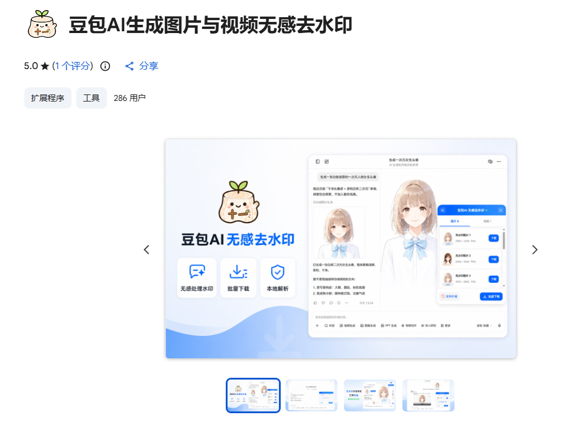
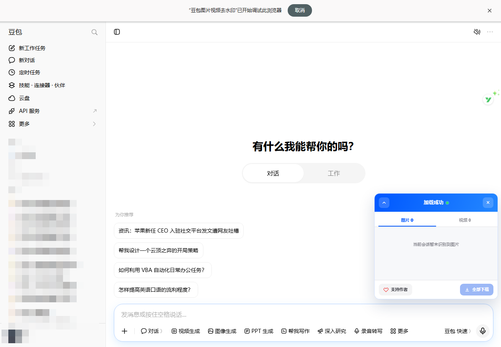
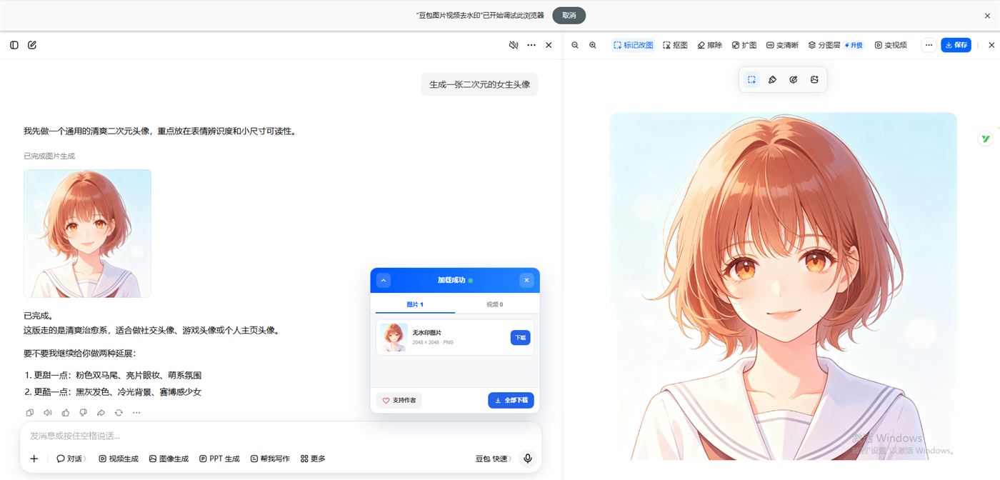
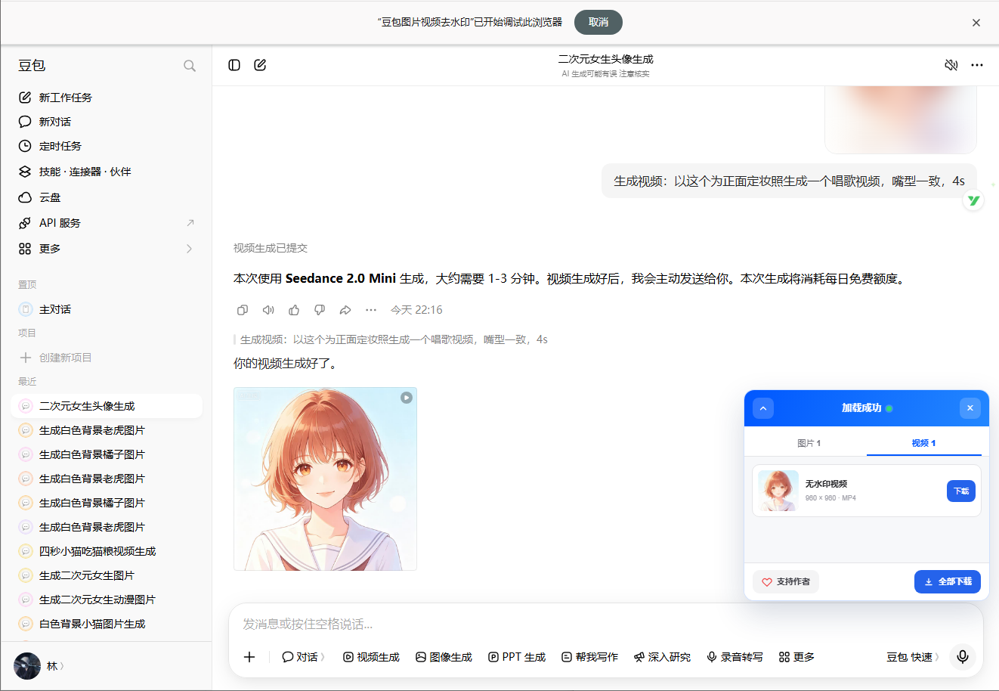
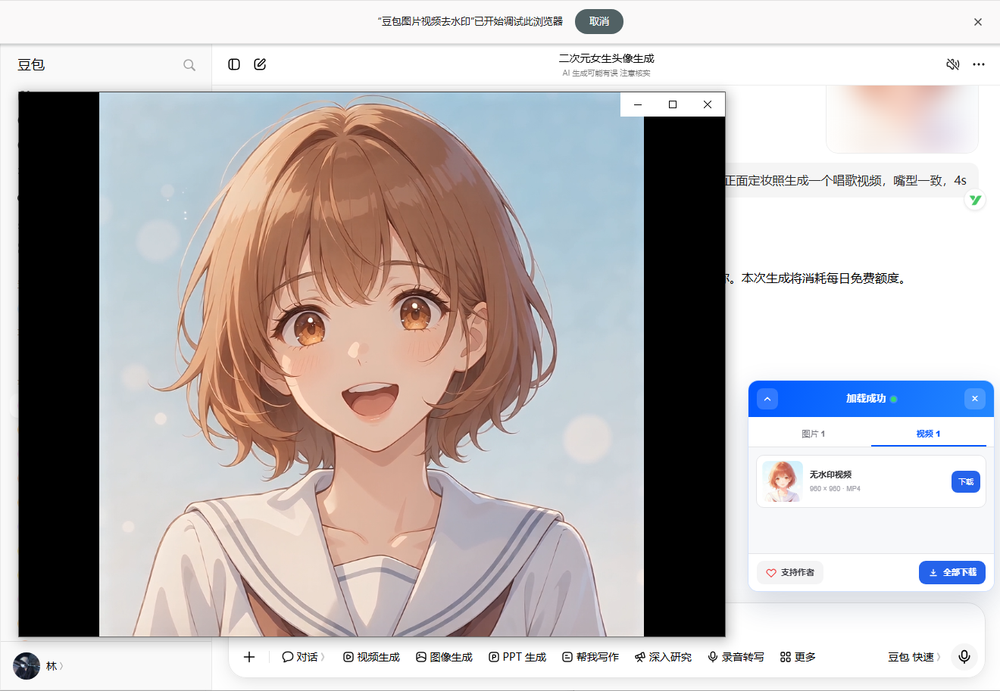
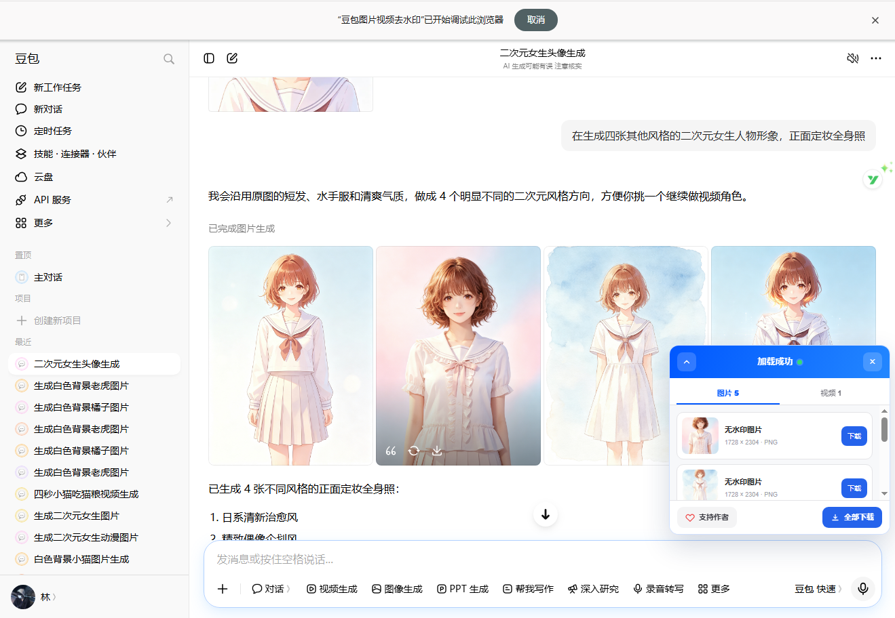
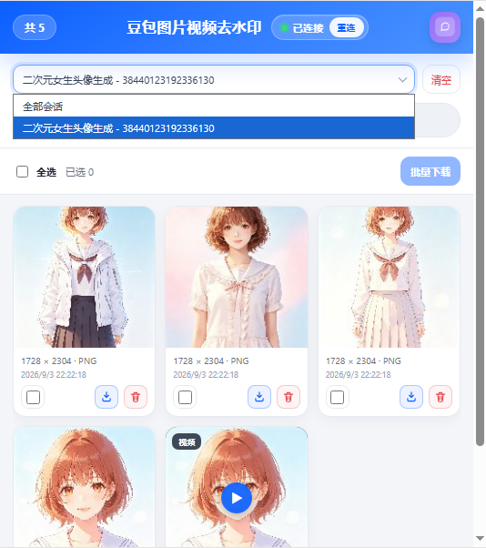
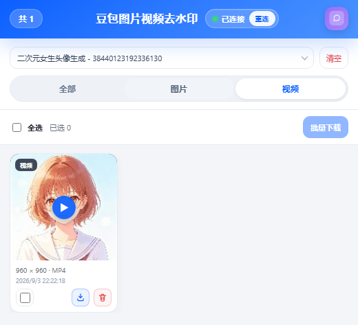
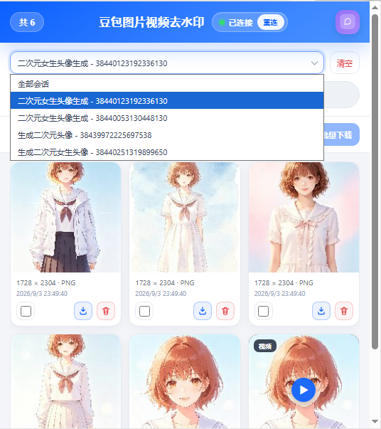
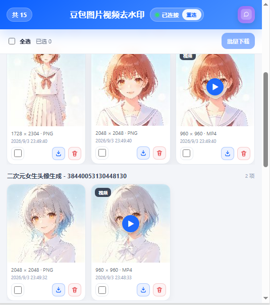

# 豆包无水印图片和视频一键下载

[](./LICENSE)
[](./CHANGELOG.md)
[](https://github.com/XiaoYu43002/DoubaoWaterMark-Remover/stargazers)

在豆包对话页一键获取无水印原图与高清无水印视频的工具/浏览器插件。支持一键下载

> [!NOTE]
> 时效：2026.9.3 测试有效
>
> 后期随时可能失效。如果不是因为原理破坏而失效，可以提 PR / Issue，我们会跟进适配。
>
> _**安装 👉 [Chrome 网上应用店](https://chromewebstore.google.com/detail/%E8%B1%86%E5%8C%85ai%E7%94%9F%E6%88%90%E5%9B%BE%E7%89%87%E4%B8%8E%E8%A7%86%E9%A2%91%E6%97%A0%E6%84%9F%E5%8E%BB%E6%B0%B4%E5%8D%B0/mopkgmfclnpcmhdbcincpcgbdmbhnmgh) | [Greasy Fork 油猴脚本](https://greasyfork.org/zh-CN/scripts/594269-%E8%B1%86%E5%8C%85%E5%9B%BE%E7%89%87%E8%A7%86%E9%A2%91%E5%8E%BB%E6%B0%B4%E5%8D%B0)**_

---

## 快速开始

### 方式一：Chrome 扩展（完整功能：图片 + 视频）

**Chrome扩展市场一键安装：** 前往 [Chrome 网上应用店](https://chromewebstore.google.com/detail/%E8%B1%86%E5%8C%85ai%E7%94%9F%E6%88%90%E5%9B%BE%E7%89%87%E4%B8%8E%E8%A7%86%E9%A2%91%E6%97%A0%E6%84%9F%E5%8E%BB%E6%B0%B4%E5%8D%B0/mopkgmfclnpcmhdbcincpcgbdmbhnmgh) 点击 **「添加至 Chrome」**。



### 方式二：油猴脚本 / Greasy Fork（图片 + 视频）

视频无水印与图片一样在页面内拦截解析，**油猴与 Chrome 扩展均可使用图+视频**（Chrome 扩展另有 Popup 资源库）。

**快速安装：**

1. 先安装 [Tampermonkey](https://www.tampermonkey.net/)（或其它油猴管理器）  
2. 打开 Greasy Fork 安装页一键安装：  
   [豆包图片视频去水印（Greasy Fork）](https://greasyfork.org/zh-CN/scripts/594269-%E8%B1%86%E5%8C%85%E5%9B%BE%E7%89%87%E8%A7%86%E9%A2%91%E5%8E%BB%E6%B0%B4%E5%8D%B0)  
3. 在 Tampermonkey 中确认启用，打开豆包对话页并刷新  

也可从仓库原始文件安装：[userscript 目录](https://github.com/XiaoYu43002/DoubaoWaterMark-Remover/tree/main/userscript)。

---

## 功能特性

### 🎛️ 就绪提示

- ✅ 进入豆包页后，**右下角**自动出现**页内蓝色面板**，顶栏显示「加载成功」说明插件正常加载即可使用

### 🖼️ 无水印图片

- ✨ **对话页无水印原图生成**：豆包对话页面新生成的图片直接展示的是无水印图片
- ⬇️ **豆包图片原生下载**：可直接利用豆包图片上的原始下载按钮进行下载
- 🖼️ **会话内图片 + 右侧大图**：豆包会话窗口内的图片与预览链路均进行了无水印处理直接可查看
- 📥 **会话窗口图片一键下载**：可直接利用页面内蓝色面板将会话窗口内生成的图片一键下载，节省时间


### 🎬 无水印高清视频

- 🚀 **高清原始无水印视频**：通过对豆包接口进行解密处理后可支持高清原始视频下载
- ℹ️ **会话内不处理需下载后查看**：不对会话里的视频播放与预览画面做无水印处理；通过面板 **下载后查看**，获得的即为豆包无水印高清视频

### 📋 媒体管理（页内面板）

- 🎛️ **页内蓝色面板**：打开豆包会话即可出现，可获取当前会话的所有资源，并且可按需选择获取图片或者视频
- 🗂️ **插件看板资源库**：可打开插件按钮查看完整案板，支持打开后的所有会话资源处理并按「会话标题 - Chat ID」进行管理，方便区分
- ✅ 勾选批量下载；支持图片 + 视频一键或者批量下载

### 📚 历史对话素材

- 打开或刷新过的会话，图片与视频会进入本机历史
- 支持按会话筛选后批量下载高质量无水印图片 / 视频
- 说明：不会在后台扫描账号里「从未打开过」的全部对话；重新打开旧会话后即可捕获

---

## 界面演示

### 1. 刚加载：插件就绪

打开豆包页后，页内面板显示「加载成功」；当前会话尚无媒体时，图片 / 视频计数为 0。



- 🟢 **加载成功**：插件已注入当前页，状态灯为绿
- 📊 **空会话提示**：未识别到媒体时显示占位文案
- ❤️ **支持作者 / 全部下载**：底部固定操作区（无媒体时下载按钮不可用）

### 2. 生成图片：水印自动消失

新生成的图片在对话预览与右侧大图中直接以无水印展示；页内面板同步收录为「无水印图片」，可单项或全部下载。



- 🖼️ **对话 / 大图无水印**：预览区不再带「豆包AI生成」角标
- ✨ **无水印图片**：面板标注分辨率与格式（如 `2048 × 2048 · PNG`）
- ⬇️ **一键下载**：条目「下载」或底部「全部下载」

### 3. 生成视频：无水印演示

生成视频后，会话内可播放无水印成片；面板切换到「视频」Tab，条目为「无水印视频」。



播放预览同样无水印：



- 🎬 **无水印视频**：面板标注分辨率与格式（如 `960 × 960 · MP4`）
- 📑 **图视分 Tab**：同一会话的图片与视频分开管理
- ⬇️ **单项 / 全部下载**：支持当前视频分类一键下载

### 4. 批量出图：会话内资源管理

同会话批量生成多张图时，对话流保持无水印；页内面板「图片」Tab 汇总本会话已捕获资源。



Popup 中可按会话查看图片 / 视频，支持全选与批量下载：

| 会话资源（全部） | 仅视频筛选 |
| :---: | :---: |
|  |  |

- 📦 **本会话汇总**：面板计数实时更新（如图片 5 / 视频 1）
- 🗂️ **Popup 网格**：缩略图 + 分辨率 / 格式 / 时间
- ✅ **批量下载**：勾选后一键提交下载队列
- 🎥 **视频筛选**：可切到「视频」Tab 只看无水印 MP4

### 5. 会话切换 · 全部资源管理

Popup 可按「会话标题 - Chat ID」切换，或选择 **全部会话** 汇总本机已捕获的图片 / 视频（非豆包账号全量历史）。

| 会话切换 | 全部会话分组 |
| :---: | :---: |
|  |  |

- 🧭 **按会话切换**：下拉选择具体会话或「全部会话」
- 📚 **本机历史库**：安装后打开 / 刷新过的会话才会进入
- 🧹 **一键清空**：可清空当前筛选范围内的本地记录
- ⬇️ **混合批量**：图片 + 视频可一起勾选下载

---

## 特别说明

### 会话范围

1. 当前打开的会话  
2. 安装后新建并打开的会话  
3. 安装前的旧会话——重新打开或刷新后再捕获  

「全部会话」= 插件本机已捕获的会话，不是豆包服务器全量历史。

### 视频原理（简要）

在页面内拦截豆包会话链路响应中的 `fallback_api`，再本地解析无水印视频地址并下载。
---

## 使用方法

### 图片

1. 打开含生成图片的豆包会话并刷新  
2. 确认会话内图、右侧大图为无水印；可用页内面板下载  
3. 豆包原生下载按钮也应尽量得到无水印原图  

### 视频

1. 打开含生成视频的会话并强制刷新  
2. 会话页内面板显示「已就绪」或「加载成功」  
3. 使用预览 / 下载；下载来源一般为字节相关视频域名  

### 历史与批量

1. 在多个会话中捕获媒体后打开可进行历史图片和视频管理 
2. 按会话与类型筛选，勾选后批量下载  
3. 需要时调整缓存上限并「立即整理」  

---

## 目录结构

```text
DoubaoWaterMark-Remover/
├── README.md
├── CHANGELOG.md
├── LICENSE
├── docs/
│   ├── testing.md
│   └── images/
├── doubaoparser/           # Chrome 扩展源码（加载已解压 / 打包输入）
│   ├── manifest.json
│   ├── icons/
│   └── opaque/
├── store/                  # Chrome 网上应用店文案与隐私政策
│   ├── LISTING.md          # 商店提交说明（名称/摘要/详细说明，可复制）
│   ├── CHROME_WEB_STORE.md
│   └── privacy-policy.md
├── tools/
│   └── pack-chrome-extension.ps1   # 生成 release/*.zip（根目录含 manifest）
├── release/                # 打包产物（gitignore，上传商店用）
└── userscript/             # 油猴 / Greasy Fork（与扩展分开发布）
```

---

## 权限与隐私

| 权限 | 用途 |
|------|------|
| `downloads` | 本机下载 |
| `storage` | 偏好设置 |
| `tabs` | 会话识别 |
| 主机权限 | 豆包 / 字节相关媒体域 |

数据仅存储在本地，不上传聊天内容到开发者服务器。

---

## 更新日志

见 [CHANGELOG.md](./CHANGELOG.md)。

---

## 开发与反馈

- 作者：**十一木**  
- Popup 内可复制微信号反馈  

## 许可证

[MIT License](./LICENSE)

## Star History

[](https://star-history.dera.page/#XiaoYu43002/DoubaoWaterMark-Remover&type=Date&legend=top-left)

---

⚠️ **免责声明**: 本扩展仅供学习交流使用，请遵守相关网站的使用条款。

**注意**：使用本服务时请遵守豆包平台的使用条款和相关法律法规
